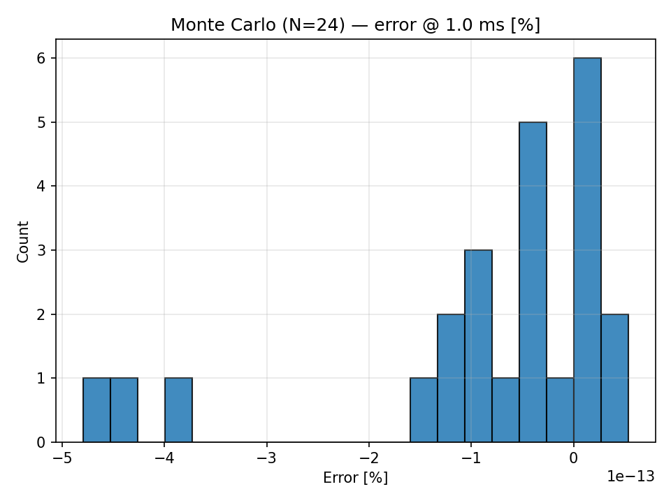

# Monte Carlo

Circuit Toolkit runs Monte Carlo jobs by mapping components to distributions and
supplying per-trial analyses. The orchestrator handles caching,
multithreading, and xarray/polars exports.



```python
from spicelab.core.circuit import Circuit
from spicelab.core.components import Vdc, Resistor, Capacitor
from spicelab.core.net import GND
from spicelab.analysis import monte_carlo, NormalPct
from spicelab.core.types import AnalysisSpec

c = Circuit("rc")
V1, R1, C1 = Vdc("1", 5.0), Resistor("1", "1k"), Capacitor("1", "100n")
c.add(V1, R1, C1)
c.connect(V1.ports[0], R1.ports[0])
c.connect(R1.ports[1], C1.ports[0])
c.connect(V1.ports[1], GND)
c.connect(C1.ports[1], GND)

mc = monte_carlo(
    circuit=c,
    mapping={R1: NormalPct(0.05)},
    n=16,
    analyses=[AnalysisSpec("op", {})],
    engine="ngspice",
    cache_dir=".spicelab_cache",
    seed=123,
)

df = mc.to_dataframe(param_prefix="param_")
print(df.head())

# Access cached handles / job metadata if needed
handles = mc.result_handles()
if mc.job:
    print("cache dir:", mc.job.cache_dir)
```

Tips:
- Use `workers` for parallel execution and optionally point `cache_dir` to reuse results between runs.
- Provide a metric function to compute scalar KPIs per trial, or set `y=[...]` and `sample_at` to extract trace values.
- `mc.result_handles()` and `mc.job` expose the underlying result handles and cache metadata when you need xarray datasets or cache diagnostics.
- When consuming results via the CLI demo (`examples/monte_carlo_demo.py`), pass `--metric-col` to enforce which dataframe column becomes the plotted metric (for example, `V(vout)`). The script exports `mc_hist`, `mc_param_scatter`, and `mc_params_matrix` HTML/PNG files when you supply `--out-html` / `--out-img`.

### Progress bar / callback

Add a lightweight progress bar to stderr:

```python
mc = monte_carlo(
    circuit=c,
    mapping={R1: NormalPct(0.01)},
    n=1000,
    analyses=[AnalysisSpec("op", {})],
    engine="ngspice",
    progress=True,   # prints: "MC: 317/1000 (31%)"
)
```

Or provide your own callback (`done`, `total`):

```python
def cb(done: int, total: int) -> None:
    print(f"{done}/{total}", end="\r")

mc = monte_carlo(
    c,
    mapping={R1: NormalPct(0.01)},
    n=1000,
    analyses=[AnalysisSpec("op", {})],
    engine="ngspice",
    progress=cb,
)
```
